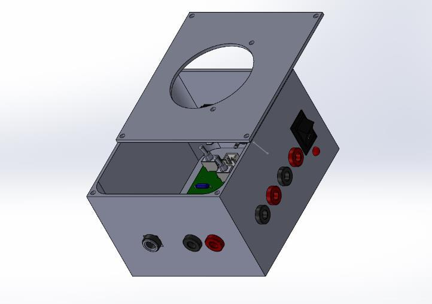

# Enclosure Design for Analog Voltmeter Project

## Overview

We have designed a custom enclosure using SolidWorks for the analog voltmeter project. This enclosure is designed to house the circuit components and provide user-friendly access to connectors and controls.

### Enclosure Specifications

- **Dimensions**: The enclosure measures 10cm x 9cm.
- **User-Friendly Design**: Special attention was given to usability and accessibility during the design process.
- **Power Supply**: The enclosure includes:
  - 4 banana connectors for laboratory power supply connection.
  - 1 barrel jack connector for 24V power supply connection. Users can choose either power source.
- **Probe Connections**: Two banana connectors are provided for connecting the probes.
- **Switches**: The enclosure features:
  - A power switch.
  - A separate switch for enabling overload protection.
- **Push Buttons**: There are 3 push buttons for range selection.

## Enclosure Design

The enclosure is designed to ensure ease of use and protection for the circuit components. It provides clear access to connectors and switches, enhancing user interaction and functionality.

### SolidWorks Design

The enclosure was created using SolidWorks, focusing on precise dimensions and ergonomic usability. Detailed attention was given to integrate all necessary components effectively.

*Figures : Enclosure design rendered using SolidWorks.*

## Future Developments

Future iterations of the enclosure may include enhancements for improved durability, aesthetics, and functionality based on user feedback and project requirements.

## Assembly Instructions

1. **Component Installation**: Carefully install the circuit components inside the enclosure.
2. **Connector Connections**: Connect the banana connectors and barrel jack as described.
3. **Switch and Button Placement**: Mount the power switch, overload protection switch, and range selection buttons in their designated positions.

