# Analog Voltmeter Project

## Overview

This repository contains the details and design files for the Analog Voltmeter project developed by Group 06 at the Department of Electronic & Telecommunication Engineering, University of Moratuwa, Sri Lanka. The project was completed in partial fulfillment of the requirements for the module EN 2091 Laboratory Practice and Projects.

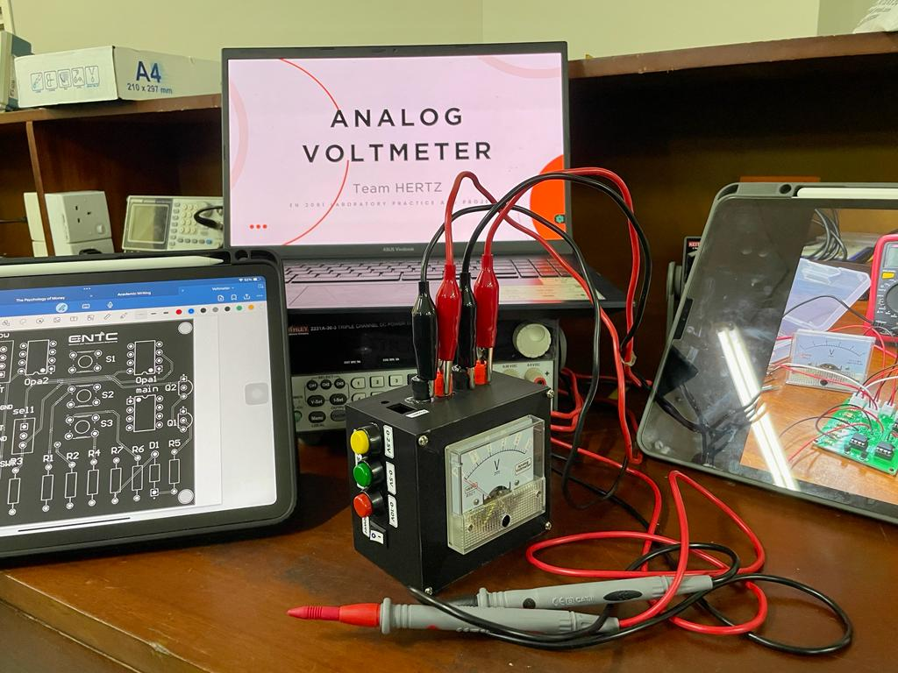

## Group Members

- Sehara G.M.M.
- Kodikara U.S.S.
- Pathirana R.P.S.
- Gunawardhana E.R.N.H.

## Project Abstract

The analog voltmeter is designed to measure voltage levels in electronic circuits across three ranges: 0-2.5V, 0-5V, and 0-10V. The device uses precision analog components like resistors, capacitors, and operational amplifiers to ensure accurate voltage measurements. The design, simulation, and optimization are carried out using NI Multisim 14.2, SolidWorks for enclosure design, and Altium for PCB design.

## Contents

1. [Introduction and Functionality](#introduction-and-functionality)
2. [System Architecture](#system-architecture)
   - [Functional Block Diagram](#functional-block-diagram)
   - [Maintaining a high Input Impedance](#maintaining-a-high-input-impedance)
   - [Overload Protection](#overload-protection)
   - [Measurement Range](#measurement-range)
   - [Analog Display Customization](#analog-display-customization)
   - [Power Supply](#power-supply)
3. [Component Selection](#component-selection)
4. [PCB Design](#pcb-design)
5. [Enclosure Design](#enclosure-design)
6. [Software Simulation and Hardware Testing](#software-simulation-and-hardware-testing)
7. [Conclusion & Future Works](#conclusion--future-works)
8. [Bill of Materials](#bill-of-materials)
9. [References](#references)

## Introduction and Functionality

The primary objective is to design a high-precision voltmeter that provides accurate voltage measurements while imposing minimal impact on the circuit under test. Unlike traditional voltmeters, our project incorporates operational amplifiers (Op-Amps) to achieve high input impedance and effectively isolate the voltmeter circuit from the measured circuit.

## System Architecture

### Functional Block Diagram

The system comprises four main blocks: input, output, power supply, and amplifier. The amplifier block consists of the main amplifier and the overload protection circuit.

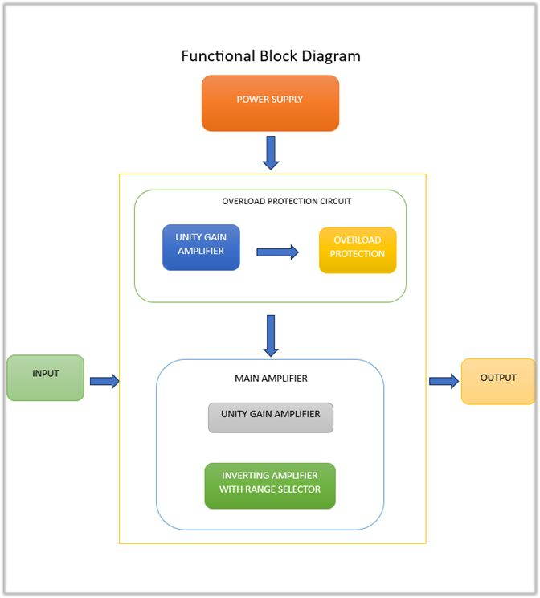

### Maintaining a high Input Impedance

A unity gain amplifier circuit utilizing the LM358 operational amplifier is used to maintain high input impedance, ensuring accurate voltage readings.

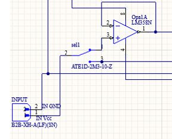

### Overload Protection

An effective overload protection system using BC558 PNP transistors and a 16-volt Zener diode is implemented to protect the voltmeter from potential overload scenarios.

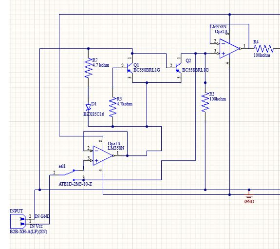

### Measurement Range

The voltmeter can measure across three distinct ranges: 0-2.5V, 0-5V, and 0-10V, with the flexibility to select the desired range using push buttons.

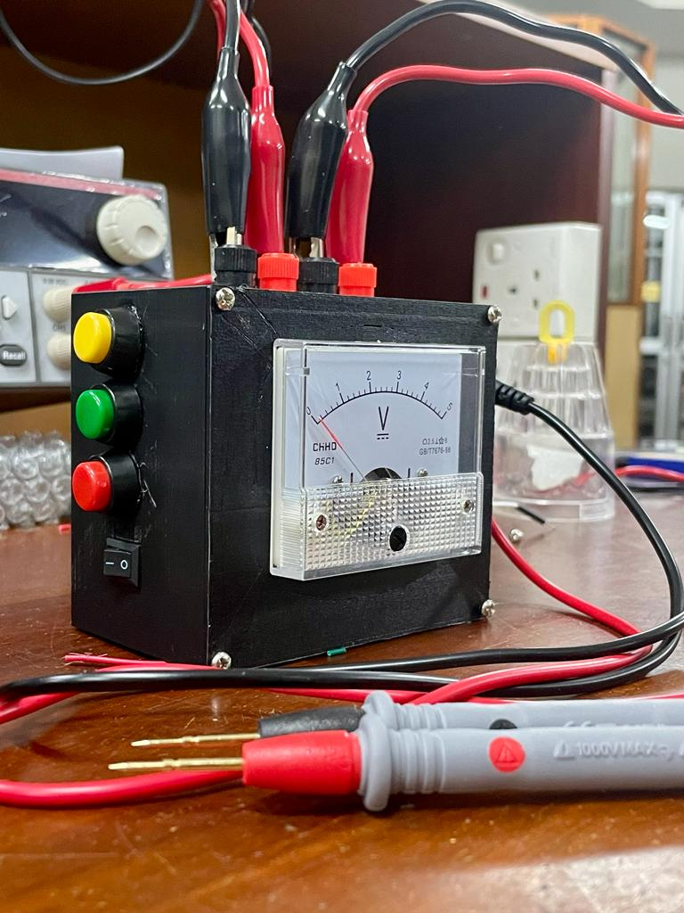

### Analog Display Customization

A customized analog display featuring an analog needle is implemented for voltage measurement across three distinct ranges.

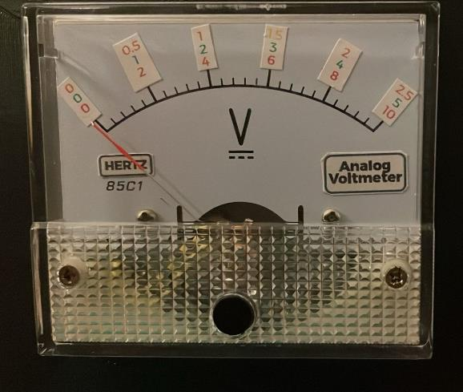

### Power Supply

A dedicated power supply circuit transforms the incoming 230V AC voltage into a consistent +12V and -12V DC supply for the operational amplifiers.

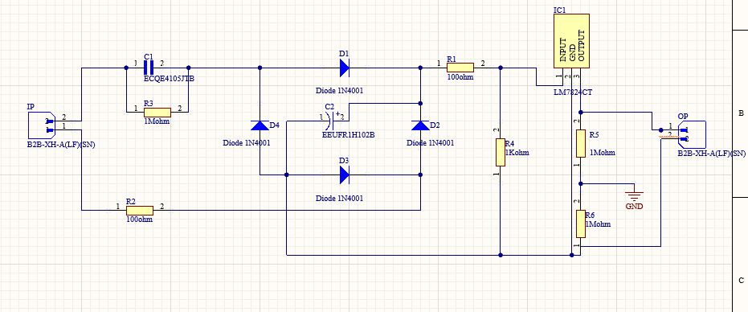

## Component Selection

- **Overload Protection**: BC558B Transistor, LM358P Op-Amp, 16V Zener diode
- **Main Amplifying Circuit**: LM358P Op-Amp, Resistors (100Kohm, 50Kohm, 200Kohm), Voltmeter Panel
- **Power Supply Circuit**: IN4001 Diodes, Capacitors, LM7824 Voltage Regulator

## PCB Design

We have designed two PCBs for the voltmeter and the power supply circuit. The PCB is designed using Altium with a compact layout to optimize performance. Design files are available in the repository.

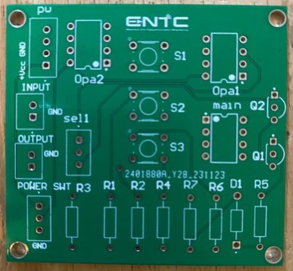
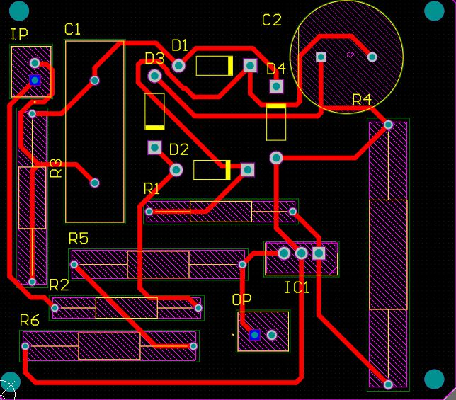

## Enclosure Design

The enclosure is designed using SolidWorks, ensuring user-friendly access and durability. Design files are available in the repository.

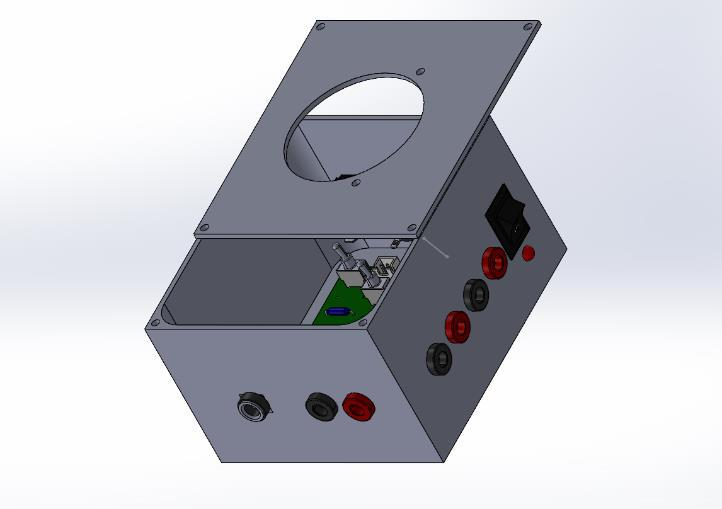

## Software Simulation and Hardware Testing

Simulations were performed using Multisim software to validate the circuit design, followed by hardware implementation and testing to ensure accurate results.

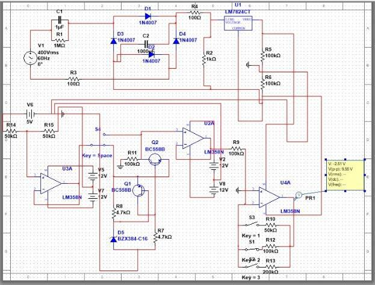
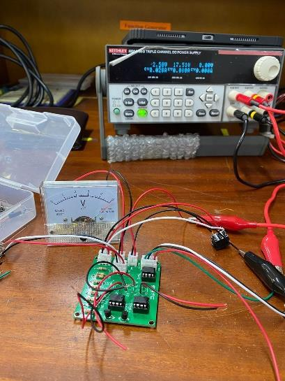
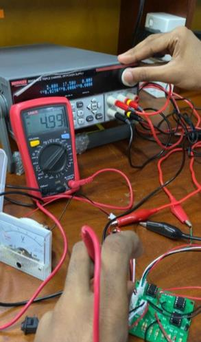

## Conclusion & Future Works

The project aims to provide a cost-effective and reliable analog voltmeter solution with emphasis on precision, durability, and ease of use. Future developments include PCB implementation for optimized power supply, boost converter integration, improved measurement parameters, and implementing a static calibration mechanism.

## Bill of Materials

| Component              | Description                         | Quantity |
|------------------------|-------------------------------------|----------|
| BC558B Transistor      | PNP Bipolar Junction Transistor     | 2        |
| LM358P Op-Amp          | Dual Operational Amplifier          | 3        |
| 16V Zener Diode        | Zener Diode for Voltage Regulation  | 1        |
| Resistor 100KΩ         | Resistor                            | 2        |
| Resistor 50KΩ          | Resistor                            | 1        |
| Resistor 200KΩ         | Resistor                            | 1        |
| Voltmeter Panel        | Analog Voltmeter Display            | 1        |
| IN4001 Diode           | General-Purpose Diode               | 4        |
| Capacitors             | Various values for filtering        | Multiple |
| LM7824 Voltage Regulator| 24V Voltage Regulator              | 1        |

---

A detailed bill of materials is provided in the report, listing all components used in the project.

## References

1. [Overvoltage Protection Circuit](https://circuitdigest.com/electronic-circuits/overvoltage-protection-circuit) (no date) Circuit Digest - Electronics Engineering News, Latest Products, Articles and Projects.
2. [Alldatasheet.com (no date) BC558 Datasheet(PDF) – semtech corporation](https://www.alldatasheet.com/datasheet-pdf/pdf/42388/SEMTECH/BC558.html), ALLDATASHEET.COM - Electronic Parts Datasheet Search.
3. [Alldatasheet.com (no date b) LM358 PDF, LM358 description, LM358 datasheet, LM358 View](https://pdf1.alldatasheet.com/datasheet-pdf/view/1648891/TI/LM358.html), ALLDATASHEET.
4. [Storr, W. (2022) Inverting operational amplifier - the inverting op-amp](https://www.electronics-tutorials.ws/opamp/opamp_2.html), Basic Electronics Tutorials.
5. [How to connect a PNP transistor in a circuit](https://www.learningaboutelectronics.com/Articles/How-to-connect-a-pnp-transistor-in-a-circuit.php) (No date).

---
## Contact

For any clarifications or inquiries please feel free to contact me at uvindukodikara@gmail.com

---
